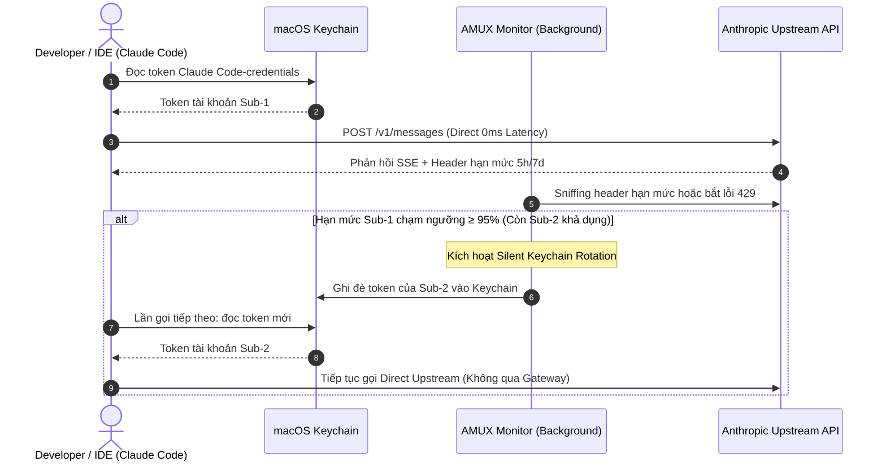
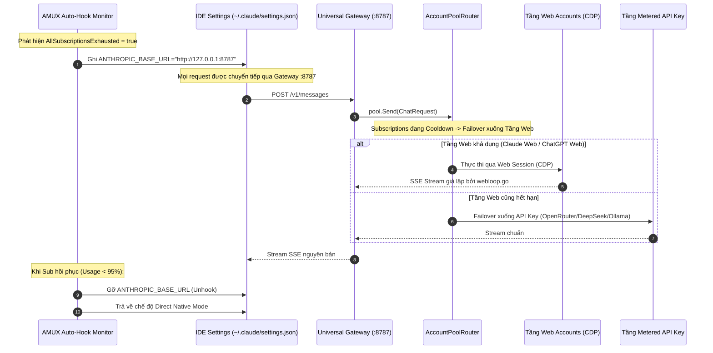
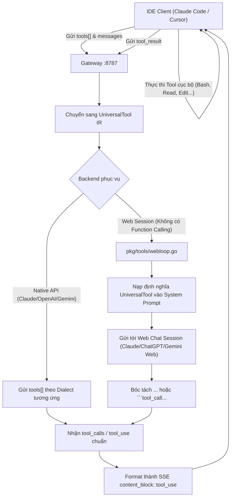

# Kiến Trúc & Thiết Kế Hệ Thống AMUX (STRUCT.md)

AMUX được thiết kế theo tư tưởng **Domain-Driven Design (DDD)** và **Plugin/Adapter Architecture**, đóng vai trò là một **AI Development Runtime & Universal AI Gateway** cho môi trường phát triển hiện đại.

---

## 1. Sơ Đồ Kiến Trúc Phân Tầng

```
┌─────────────────────────────────────────────────────────────────────────┐
│                           HUMAN DEVELOPER                               │
└────────────────────────────────────┬────────────────────────────────────┘
                                     │
                                     ▼
┌─────────────────────────────────────────────────────────────────────────┐
│                         AI APPLICATIONS                                 │
│          (Claude Code CLI, Cursor IDE, Codex CLI, Antigravity)          │
└────────────────────────────────────┬────────────────────────────────────┘
                                     │
         ┌───────────────────────────┴───────────────────────────┐
         │                                                       │
         ▼ [Phase 1: Quota Healthy]                              ▼ [Phase 2: All Subs Exhausted]
┌─────────────────────────────────────────┐             ┌───────────────────────────────────┐
│     NATIVE DIRECT MODE (Zero-Touch)     │             │     AMUX UNIVERSAL AI GATEWAY     │
│   IDE đọc Token từ macOS Keychain       │             │   Proxy Server :8787 (Daemon)     │
│   Gọi thẳng Upstream (0ms Overhead)     │             │   Tự động Hook ANTHROPIC_BASE_URL │
│   Xoay tua ngầm Keychain khi chạm 95%   │             │   Auto-Detach khi Quota hồi phục  │
└────────────────────┬────────────────────┘             └─────────────────┬─────────────────┘
                     │                                                    │
                     │                                                    ▼
                     │                                  ┌───────────────────────────────────┐
                     │                                  │       UNIVERSAL TOOL ENGINE       │
                     │                                  │   Canonical UniversalTool IR      │
                     │                                  │   100% JSON Schema Preserved      │
                     │                                  │   Bidirectional MCP & Web-Loop    │
                     │                                  └─────────────────┬─────────────────┘
                     │                                                    │
                     ▼                                                    ▼
┌───────────────────────────────────────────────────────────────────────────────────────────┐
│                              PROVIDERS & MODEL BACKENDS                                   │
│  Tầng 1: Subscriptions (OAuth PKCE)  │ Tầng 2: Web Sessions (CDP) │ Tầng 3: Metered API   │
│  Anthropic Pro/Team, OpenAI Pro/Plus │ Claude Web, ChatGPT Web    │ OpenRouter, DeepSeek, │
│  Codex CLI Reuse, Google AGY OAuth   │ Gemini Web (Free Quota)    │ Ollama, vLLM, Custom  │
└───────────────────────────────────────────────────────────────────────────────────────────┘
```

---

## 2. Phân Tầng Trách Nhiệm Các Package Cốt Lõi

| Phân Tầng | Package | Trách Nhiệm Vận Hành |
| :--- | :--- | :--- |
| **Runtime Entry** | `pkg/cli` | Tiếp nhận và điều phối bộ lệnh CLI tối giản (`setup`, `status`, `usage`, `id`, `gateway`, `config`, `doctor`). |
| **Domain Contracts** | `pkg/types` | Hạt nhân độc lập: Định nghĩa `ChatRequest`, `ChatMessage`, `StreamChunk`, `ProviderAdapter`, `UniversalTool`, và `BaseDir()` (`~/.amux`). Tuyệt đối không import package nội bộ khác. |
| **Security & Identity** | `pkg/identity` & `pkg/auth` | Quản lý danh tính phẳng (`identities.json`), đọc/ghi an toàn qua macOS Keychain, mã hóa AES-256-GCM, quản lý vòng đời OAuth PKCE token và tính toán ngưỡng failover. |
| **Universal Gateway** | `pkg/proxy` | Máy chủ Reverse Proxy HTTP tại cổng `:8787`, cơ chế bảo mật Public Gateway bằng Ephemeral Bearer Token (`amux-<hex>`), bộ đệm chống brute-force (10 lỗi/phút), và chuyển tiếp bitwise 1:1. |
| **Universal Tool Engine** | `pkg/tools` | Mô hình công cụ chuẩn mực (`UniversalTool` IR), bộ chuyển đổi hai chiều Anthropic ↔ OpenAI ↔ Gemini ↔ MCP, bảo toàn cú pháp (`pkg/tools/protect.go`), và bộ giả lập Web-Loop (`webloop.go`). |
| **Multi-Tier Router** | `pkg/router` | Điều phối thứ tự ưu tiên 3 tầng (Subscription → Web → API Key), quản lý cooldown tự thích ứng theo header `Retry-After`, phân loại tác vụ (`classifier.go`), và loại trừ tài khoản `AUTO-SWITCH: OFF`. |
| **Protocol Bridges** | `pkg/bridge` | Cầu nối đa giao thức: OpenAI `/v1/chat/completions`, Anthropic `/v1/messages`, Gemini `/v1beta/models/...`, bảo toàn CoT Thinking và Gemini Thought Signatures. |
| **Anti-Ban Defense** | `pkg/guard` | Lớp phòng vệ 5 tầng: Header Sanitizer, Micro-jitter Pacing, Circuit Breaker, Session Affinity, và Egress Proxy riêng biệt. |
| **Context Optimization** | `pkg/ctxshrink` | Bảo tồn Prompt Cache Prefix cho Subscription accounts; chỉ kích hoạt nén ngữ cảnh có chọn lọc trên Web accounts hẹp. |
| **Browser CDP Engine** | `pkg/browser` | Tự động phát hiện Chromium mặc định của hệ điều hành (Brave, Edge, Chrome) và tự động trích xuất cookie xác thực qua Chrome DevTools Protocol. |
| **Token Analytics** | `pkg/usage` | Đo lường token stream thời gian thực và tổng hợp theo 3 chế độ chuẩn: `day`, `week`, `month`. |
| **Statusline UI** | `pkg/ui` | Render statusline hiển thị thời gian thực cho Claude Code, Cursor và Codex, hiển thị tài khoản, token và thanh đo hạn mức 5h/7d. |

---

## 3. Các Luồng Hoạt Động Cốt Lõi

### Luồng 1: Silent Keychain Rotation (Zero-Touch Native Mode)

Khi nhà phát triển sử dụng các công cụ IDE chính thức (Claude Code, Cursor, Codex):



---

### Luồng 2: Conditional Gateway Injection & Multi-Tier Failover

Xảy ra khi **100% tài khoản Subscription cạn kiệt**:



---

### Luồng 3: Universal Tool Engine & Web-Loop Emulation

Đảm bảo tài khoản Web Session vẫn có khả năng thực thi công cụ tương đương API trả phí:



---

## 4. Nguyên Tắc Vận Hành Bất Biến

1. **Thư Mục Lưu Trữ Chuẩn Hóa (`~/.amux`)**:
   - Mọi tệp cấu hình (`identities.json`, `config.json`, `gateway.pid`, `gateway.log`) được lưu trữ tập trung tại `~/.amux`.
   - Hệ thống tự động di chuyển dữ liệu từ thư mục cũ sang `~/.amux` trong lần chạy đầu tiên mà không làm mất mát cấu hình.
2. **Không Khởi Chạy Ứng Dụng (No Launcher Responsibility)**:
   - AMUX không bao bọc hay can thiệp vào cách khởi chạy IDE (`claude`, `cursor`, `codex`). Developer chạy công cụ trực tiếp.
3. **Bảo Toàn Prompt Cache Tuyệt Đối**:
   - Khi chuyển đổi giữa các tài khoản Subscription, AMUX giữ nguyên 100% nội dung và thứ tự tin nhắn lịch sử để tận dụng chiết khấu 90% từ Anthropic Prompt Cache.
4. **Loại Trừ Nghiêm Ngặt Tài Khoản OFF**:
   - Tài khoản có `AUTO-SWITCH: OFF` (chế độ Manual Only) tuyệt đối không bao giờ bị auto-switch hoặc tự động chọn từ pool, áp dụng cho cả Subscription, Web và API accounts.
5. **Real-time Statusline Trực Quan**:
   - Cung cấp thông tin tài khoản đang phục vụ, dung lượng token và thanh đo hạn mức 5h/7d trực tiếp trên thanh trạng thái của IDE theo thời gian thực.
