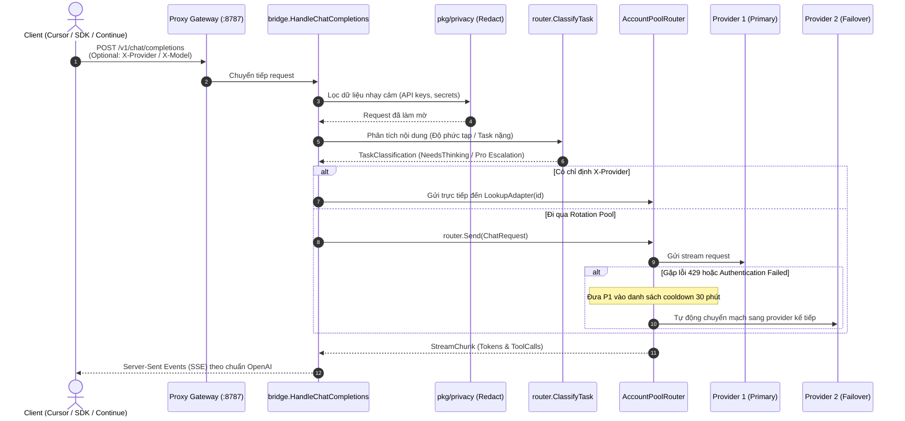
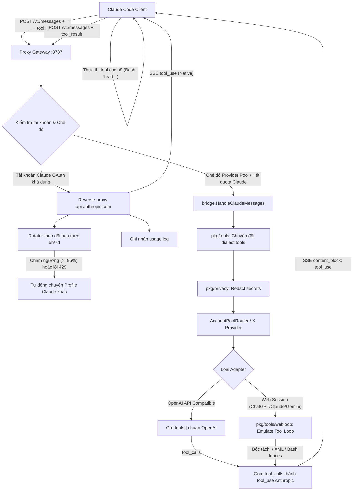
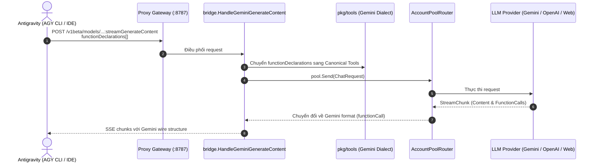
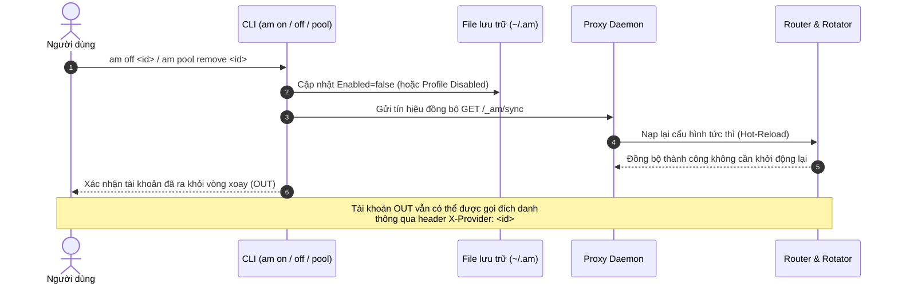

# Kiến Trúc Dự Án `amux` (STRUCT.md)

Dự án `amux` (CLI `am`) được xây dựng theo **Standard Go Project Layout**, kết hợp tư tưởng **Domain-Driven Design (DDD)** và **Plugin/Adapter Architecture**.

Tài liệu này mô tả chi tiết toàn bộ cây thư mục, cấu trúc mã nguồn, phân tầng trách nhiệm các package, cùng các luồng dữ liệu cốt lõi trong hệ thống.

---

## 1. Sơ Đồ Cây Thư Mục Toàn Diện

```
amux/
├── main.go                         # Entrypoint mỏng — cli.Run(os.Args)
├── accounts.example.json           # Schema mẫu cấu hình providers (ID brand[:method]:NN)
├── install.sh                      # Script cài đặt tự động từ source (macOS, Go 1.26+)
├── STRUCT.md                       # Kiến trúc & chi tiết thiết kế hệ thống
├── README.md                       # Tài liệu hướng dẫn sử dụng và tra cứu CLI
├── go.mod / go.sum                 # Go modules & dependencies
│
├── assets/                         # Tài nguyên thương hiệu & UI
│   ├── logo.svg                    # Vector logo
│   └── logo.png                    # Raster logo
│
├── bin/                            # Binary đầu ra sau build
│   └── am                          # Symlink hoặc binary tiện ích CLI
│
├── commands/                       # Slash command templates cho Claude Code
│   └── feedback.md                 # Template lệnh /am:feedback
│
├── docs/                           # Tài liệu thiết kế chuyên sâu & báo cáo
│   ├── token-compression.md        # Thiết kế lớp nén ngữ cảnh và tối ưu hóa token
│   └── reports/                    # Báo cáo đối chiếu và inventory công cụ
│       ├── index.html              # Báo cáo tổng hợp
│       ├── inventory.html / .md    # Danh mục tính năng & adapters
│       ├── claude-code-tools.html  # Phân tích công cụ Claude Code
│       ├── antigravity-tools.html  # Phân tích công cụ Antigravity (AGY)
│       ├── codex-tools.html        # Phân tích công cụ Codex CLI
│       └── cursor-tools.html       # Phân tích công cụ Cursor IDE
│
└── pkg/
    ├── cli/                        # [ENTRYPOINT] Bộ phân phối lệnh CLI
    │   ├── cli.go                  # Dispatcher chính, flags, setup, run, proxy, logs...
    │   ├── account.go              # Quản lý toggle account (off/on), pool commands, ID resolver
    │   └── cli_test.go             # Unit tests cho CLI parsing & actions
    │
    ├── types/                      # [DOMAIN CORE] Contracts & Types dùng chung (Zero internal deps)
    │   ├── chat.go                 # ChatMessage, ChatRequest, StreamChunk, ProviderAdapter, ToolDef, ToolCall
    │   ├── profile.go              # ProfileMeta, Artifact, Token, Profile snapshot info
    │   ├── usage.go                # UsageEntry, UsageSummary, lọc theo project/model/thời gian
    │   ├── config.go               # BaseDir() (~/.am), ToolConfig, đường dẫn tệp tin cấu hình
    │   ├── id.go                   # ParseID, FormatID (brand[:method]:NN)
    │   ├── account_id.go           # CanonicalAccountID, chuẩn hóa định danh tài khoản
    │   ├── id_test.go              # Unit tests định dạng ID
    │   └── account_id_test.go      # Unit tests chuẩn hóa ID
    │
    ├── auth/                       # [AUTH] Quản lý khóa, OAuth & Mã hóa
    │   ├── keychain.go             # Wrapper đọc/ghi an toàn qua macOS Keychain
    │   ├── token.go                # Đọc, xác thực và refresh Claude OAuth tokens
    │   ├── crypto.go               # Mã hóa/giải mã AES-256-GCM (AMENC1:), Scrypt key derivation
    │   └── crypto_test.go          # Tests mã hóa AES-256-GCM
    │
    ├── profile/                    # [PROFILE] Quản lý snapshot hồ sơ tài khoản CLI
    │   ├── manager.go              # CRUD hồ sơ (.amp archive, .meta.json), enable/disable
    │   ├── transfer.go             # Đóng gói xuất/nhập hồ sơ mã hóa (.amexp) giữa các máy
    │   ├── manager_test.go         # Tests quản lý profile và đồng bộ
    │   └── disabled_test.go        # Tests trạng thái disable profile
    │
    ├── provider/                   # [PLUGIN] LLM Adapters & Quản lý accounts.json
    │   ├── config.go               # Load/Save accounts.json, migrate ID cũ, LoadAccounts, LoadAllAddressable
    │   ├── pool_slot.go            # Metadata và runtime state cho các slot trong rotation pool
    │   ├── openai.go               # Adapter OpenAI-compatible chuẩn (GitHub, Groq, OpenRouter, vLLM...)
    │   ├── gemini.go               # Adapter Google Gemini Native API (hỗ trợ reasoning/thinking escalation)
    │   ├── gemini_web.go           # Adapter Gemini Web session (cookie xác thực)
    │   ├── chatgpt_web.go          # Adapter ChatGPT Web session (access token, conversation threading)
    │   ├── chatgpt_sentinel.go     # Giải mã Proof-of-Work SHA3-512 và lấy token OpenAI Sentinel
    │   ├── claude_web.go           # Adapter Claude Web session (sessionKey)
    │   ├── codex_cli.go            # Tái sử dụng session token của Codex CLI thành adapter codex:NN
    │   ├── match.go                # Tìm kiếm và so khớp linh hoạt ID provider (MatchID, fuzzy match)
    │   ├── prompt.go               # Nối ghép lịch sử hội thoại (BuildConcatenatedPrompt) cho web adapters
    │   ├── stream.go               # Trình đọc và phân tích SSE (Server-Sent Events) stream chunks
    │   ├── uuid.go                 # Sinh UUID nhanh cho phiên web chat
    │   ├── http_client.go          # HTTP client dùng chung với connection pooling & timeouts
    │   └── *_test.go               # Kiểm thử cho adapter, sentinel, prompt, matching, escalation
    │
    ├── browser/                    # [BROWSER] Trích xuất Cookie & Tự động hóa trình duyệt
    │   ├── cookies.go              # Giải mã cookie trình duyệt Chromium từ macOS Keychain
    │   ├── cdp_login.go            # Tự động hóa luồng đăng nhập qua Chrome DevTools Protocol (CDP)
    │   ├── claude_account.go       # Bóc tách thông tin tài khoản Claude từ session trình duyệt
    │   └── *_test.go               # Kiểm thử trích xuất cookie và tài khoản
    │
    ├── router/                     # [ROUTER] Bộ điều tuyến & Phân loại tác vụ
    │   ├── pool.go                 # AccountPoolRouter: quản lý pool, ưu tiên priority, 30m 429 cooldown, X-Provider
    │   ├── classifier.go           # ClassifyTask: phân tích độ phức tạp, tác vụ nặng, bật thinking, escalate Pro
    │   └── *_test.go               # Tests pool routing, task classification, preferred failover
    │
    ├── bridge/                     # [BRIDGE] Cầu nối giao thức & Chuyển đổi định dạng
    │   ├── openai.go               # Xử lý /v1/chat/completions và /v1/models theo chuẩn OpenAI
    │   ├── claude.go               # Xử lý /v1/messages cho Claude Code (Anthropic ↔ Canonical)
    │   ├── gemini.go               # Xử lý /v1beta/models/... cho Antigravity (Google GenAI ↔ Canonical)
    │   ├── headers.go              # Xử lý routing headers (X-Provider, X-Model) và xác thực
    │   ├── requestlog.go           # Ghi log I/O chi tiết của request/response phục vụ quan sát
    │   └── *_test.go               # Tests bridge OpenAI, Claude, Gemini, Thinking, Tool execution
    │
    ├── privacy/                    # [PRIVACY] Kiểm duyệt và ẩn danh dữ liệu
    │   ├── redact.go               # Che email, API key, webhook, token, credit card trên payload outbound
    │   └── redact_test.go          # Tests cơ chế lọc và ẩn thông tin nhạy cảm
    │
    ├── guard/                      # [GUARD] Lớp phòng thủ chống quét & bảo vệ tài khoản (Anti-Ban Engine)
    │   ├── guard.go                # Facade điều phối các cơ chế bảo vệ, quản lý singleton
    │   ├── sanitizer.go            # Khử rò rỉ headers nội bộ (X-Provider, Via, X-Forwarded-*)
    │   ├── pacer.go                # Điều tiết nhịp độ (pacing), trễ giả lập (micro-jitter) & exponential backoff
    │   ├── health.go               # Chấm điểm Health Score (0-100), Circuit Breaker & Auto-Quarantine cách ly
    │   ├── affinity.go             # Session & Thread Affinity (ghim tài khoản cố định theo phiên làm việc)
    │   ├── proxy_egress.go         # Quản lý proxy riêng biệt (HTTP, SOCKS5) cho từng tài khoản/profile
    │   └── guard_test.go           # Unit tests toàn diện cho bộ guard
    │
    ├── tools/                      # [TOOL MID-LAYER] Chuẩn hóa Tool Calling đa nền tảng
    │   ├── dialect.go              # Canonical Tool types (ToolDef, ToolCall, ToolResult)
    │   ├── claude.go               # Chuyển đổi tool schema và tool_use / tool_result của Anthropic
    │   ├── openai.go               # Chuyển đổi tools.function và tool_calls của OpenAI
    │   ├── gemini.go               # Chuyển đổi functionDeclarations và functionCall của Gemini
    │   ├── cursor.go               # Dialect tương thích công cụ Cursor IDE
    │   ├── codex.go                # Dialect tương thích công cụ Codex CLI
    │   ├── webloop.go              # Giả lập tool calling (<tool_call>) cho các web session models
    │   └── *_test.go               # Tests tool conversions, dialect loops, webloop emulation
    │
    ├── utils/                      # [UTILS] Tiện ích schema dùng chung
    │   ├── schema.go               # Chuyển đổi và chuẩn hóa JSON Schema giữa các provider
    │   └── schema_test.go          # Tests chuẩn hóa schema
    │
    ├── proxy/                      # [GATEWAY DAEMON] Máy chủ Proxy :8787
    │   ├── server.go               # Khởi chạy HTTP server, routing, passthrough, admin endpoints (/_am/*)
    │   ├── rotator.go              # Xoay vòng tài khoản Claude OAuth, theo dõi giới hạn 5h/7d, auto-switch
    │   ├── addr.go                 # Chuẩn hóa địa chỉ lắng nghe, phát hiện bind public/local
    │   ├── authtoken.go            # Cấp phát API key tạm thời amux-<hex>, xác thực khi bind public, rate limit
    │   ├── tunnel.go               # Xử lý HTTP CONNECT tunneling cho HTTP_PROXY / HTTPS_PROXY
    │   ├── bind.go                 # Cấu hình socket network listener
    │   ├── client.go               # Giao tiếp client với proxy daemon (ProxyUp, ProxyBase, Sync)
    │   ├── lifecycle.go            # Theo dõi vòng đời phiên làm việc (PID của Claude Code/AGY tabs)
    │   ├── supervisor.go           # Watchdog giám sát và xử lý phục hồi khi dịch vụ suy giảm
    │   ├── passthrough.go          # Handler reverse-proxy trực tiếp tới Anthropic khi graceful shutdown
    │   └── *_test.go               # Tests server, rotator, authtoken, lifecycle, supervisor
    │
    ├── monitor/                    # [OBSERVABILITY] Giám sát, chẩn đoán lỗi & sự kiện
    │   ├── store.go                # Lưu trữ nhật ký sự kiện (~/.am/events.log) và request I/O (~/.am/requests.log)
    │   ├── sink.go                 # Ghi nhật ký vào terminal, ~/.am/events.log, ~/.am/requests.log
    │   ├── error_diag.go           # Lưu vết lỗi turns (~/.am/errors.log), log_stats.json, 7-day retention cleanup
    │   └── *_test.go               # Tests query lưu trữ và chẩn đoán lỗi
    │
    ├── usage/                      # [METRICS] Đo lường & thống kê tiêu thụ token
    │   ├── capture.go              # Tee-reader bóc tách token từ luồng phản hồi streaming
    │   ├── project.go              # Định danh thư mục dự án dựa trên port kết nối của client
    │   ├── usage.go                # Thống kê và tổng hợp token theo ngày, tuần, tháng, project, model
    │   └── *_test.go               # Tests capture và tính toán usage
    │
    ├── term/                       # [TERM STYLING] Giao diện dòng lệnh tối giản & Bảng màu Clean ANSI
    │   ├── style.go                # Định nghĩa màu sắc ANSI, palette thích ứng Dark/Light, format label & header
    │   ├── log.go                  # Định dạng thông điệp log theo cấp độ với nhãn thời gian thực
    │   └── style_test.go           # Tests render style & ANSI formatting
    │
    ├── hook/                       # [INTEGRATION] Vòng đời Hooks & Tự động cập nhật
    │   ├── hook.go                 # Quản lý lifecycle hooks cho Claude Code, AGY, Codex, Cursor
    │   ├── launchctl.go            # Đồng bộ biến môi trường vào macOS GUI session qua launchctl
    │   ├── feedback.go             # Hỗ trợ mở issue GitHub kèm thông tin hệ thống đã khử thông tin nhạy cảm
    │   ├── autoupdate.go           # Tự động cập nhật daemon nền qua macOS LaunchAgent
    │   └── *_test.go               # Tests hook configuration, launchctl sync, autoupdate
    │
    ├── env/                        # [SHELL ENV] Xuất & lưu trữ cấu hình môi trường
    │   ├── env.go                  # eval "$(am env)", đồng bộ biến môi trường, am env set/get/rm/list
    │   └── env_test.go             # Tests shell environment output và persistence
    │
    └── ui/                         # [PRESENTATION] Giao diện CLI tương tác
        ├── picker.go               # Menu tương tác chọn nhanh profile hoặc provider bằng phím mũi tên
        ├── status.go               # Báo cáo trạng thái hoạt động am status và am guard
        └── login.go                # Wizard hướng dẫn đăng nhập tài khoản trình duyệt và cấu hình API
```

---

## 2. Chi Tiết Trách Nhiệm Các Package

| Package | Phân Tầng | Trách nhiệm chính |
| :--- | :--- | :--- |
| `main.go` & `pkg/cli` | **Entrypoint** | Tiếp nhận lệnh CLI; điều phối các chức năng tài khoản (`off`/`on`), cấu hình pool, quản lý proxy, guard, login, logs, run tool... |
| `pkg/types` | **Domain Core** | Định nghĩa toàn bộ contracts, interfaces, và chuẩn định dạng ID (`brand[:method]:NN`). Tuyệt đối không import các package nội bộ khác. |
| `pkg/auth` | **Security / Auth** | Đọc/ghi macOS Keychain, quản lý & refresh OAuth token của Claude, mã hóa AES-256-GCM (`AMENC1:`) bằng master key Scrypt. |
| `pkg/profile` | **Profile Domain** | Đóng gói snapshot môi trường CLI (`.amp`), chuyển đổi export/import (`.amexp`), quản lý bật/tắt profile trong xoay vòng. |
| `pkg/provider` | **Adapter Plugin** | Hiện thực các LLM provider (OpenAI API, Gemini Native API, Claude/ChatGPT/Gemini Web session, Codex CLI reuse); tự động giải mã Sentinel PoW challenge (`chatgpt_sentinel.go`); đồng bộ `accounts.json`. |
| `pkg/browser` | **Infrastructure** | Tự động hóa đăng nhập trình duyệt (CDP) và trích xuất cookie Chromium từ macOS Keychain. |
| `pkg/router` | **Routing & Intelligence** | Quản lý failover pool theo mức độ ưu tiên (`priority`), tự động phạt cooldown khi gặp 429; phân loại độ phức tạp tác vụ (`classifier.go`) để tự động kích hoạt thinking mode hoặc escalate Pro model. |
| `pkg/bridge` | **Protocol Bridge** | Cầu nối đa giao thức: OpenAI (`/v1/chat/completions`), Anthropic (`/v1/messages`), Google Gemini (`/v1beta/models/...`); điều hướng bằng `X-Provider`/`X-Model`; ghi log I/O bảo mật. |
| `pkg/privacy` | **Data Protection** | Quét và làm mờ (redact) các dữ liệu nhạy cảm (email, API key, webhook, token, thẻ ngân hàng) trước khi gửi ra upstream. |
| `pkg/guard` | **Anti-Ban Engine** | Lớp phòng thủ 5 tầng chống bị phát hiện/gắn cờ tài khoản: Header Sanitizer, Traffic Pacing/Jitter, Health Score & Circuit Breaker, Session Affinity, Egress Proxy riêng biệt. |
| `pkg/tools` | **Tool Mid-Layer** | Chuẩn hóa schema công cụ giữa Claude Code, Cursor, Codex, Gemini (Antigravity); giả lập vòng lặp gọi tool (`webloop.go`) cho các web session. |
| `pkg/utils` | **Shared Utilities** | Tiện ích chuyển đổi và chuẩn hóa JSON Schema dùng chung giữa các adapter. |
| `pkg/proxy` | **Gateway Daemon** | Lắng nghe tại cổng `:8787`, cơ chế tự động xoay vòng tài khoản (Rotator), cấp phát API key tạm thời khi mở mạng (`authtoken.go`), HTTP CONNECT tunnel, watchdog giám sát. |
| `pkg/monitor` | **Observability** | Ghi nhật ký sự kiện (`events.log`), lưu vết I/O (`requests.log`), chẩn đoán lỗi turn (`errors.log`) và tự động dọn dẹp sau 7 ngày (`error_diag.go`). |
| `pkg/usage` | **Metrics & Analytics** | Bóc tách số lượng token streaming, liên kết với thư mục dự án của client, thống kê theo ngày/tuần/tháng. |
| `pkg/term` | **Term Styling** | Bảng màu ANSI thích ứng Dark/Light, định dạng dòng lệnh tối giản, nhãn rõ ràng, log có gắn nhãn thời gian thực. |
| `pkg/hook` | **Integration / System** | Cài đặt lifecycle hooks chuẩn hóa cho Claude Code, Antigravity, Codex, Cursor; đồng bộ biến môi trường với `launchctl`; tự động cập nhật qua LaunchAgent. |
| `pkg/env` | **Shell Environment** | Cung cấp lệnh xuất môi trường `eval "$(am env)"`, lưu trữ cấu hình môi trường tùy biến (`am env set/get/rm/list`). |
| `pkg/ui` | **Presentation** | Giao diện dòng lệnh tương tác: menu chọn nhanh `picker`, báo cáo trạng thái `status` & `guard`, wizard đăng nhập `login`. |

---

## 3. Các Luồng Dữ Liệu Cốt Lõi

### Luồng 1: OpenAI Gateway (`/v1/chat/completions`) & Task Classifier



---

### Luồng 2: Claude Code (`/v1/messages`) & Tool Execution

Claude Code giữ toàn quyền thực thi công cụ cục bộ (Bash, Read, Edit, Write...). amux đóng vai trò làm cổng chuyển ngữ và định tuyến trong suốt:



---

### Luồng 3: Gemini / Antigravity Gateway (`/v1beta/models/...`)

Antigravity (AGY CLI & IDE) sử dụng giao thức Gemini Native để giao tiếp:



---

### Luồng 4: Quản Lý Bật/Tắt Tài Khoản & Cơ Chế Hot-Reload



---

## 4. Nguyên Tắc Thiết Kế & Mở Rộng Hệ Thống

1. **Phụ thuộc một chiều (Zero Circular Dependencies):**
   - `pkg/types` là hạt nhân cốt lõi, định nghĩa contracts và không bao giờ import ngược bất kỳ package nào trong dự án.
2. **Context & Session Retention:**
   - Mọi adapter phục vụ failover bắt buộc phải đảm bảo duy trì toàn vẹn lịch sử hội thoại thông qua `BuildConcatenatedPrompt` hoặc cấu trúc message chuẩn.
3. **Failover tự phục hồi (Graceful Failover):**
   - Khi gặp mã lỗi HTTP 429 hoặc lỗi xác thực từ nhà cung cấp, adapter kích hoạt lỗi chuẩn (`ErrRateLimitReached`, `ErrAuthentication`), chuyển mạch sang node tiếp theo và áp dụng thời gian chờ (cooldown 30 phút).
4. **An toàn thông tin tối đa (Privacy-First):**
   - Tất cả payload gửi ra ngoài hệ thống mạng bắt buộc phải đi qua bộ lọc `pkg/privacy`. Các khóa bí mật, token, chuỗi webhook thật tuyệt đối không được ghi nhận trong mã nguồn hoặc tệp test.
5. **Định danh nhất quán (Stable Unified ID):**
   - Mọi tài khoản tuân thủ định dạng chuẩn `brand[:method]:NN` (ví dụ: `claude:web:01`, `github:api:01`, `gemini:api:02`). Cơ chế `MigrateLegacyIDs` tự động chuyển đổi các định danh cũ mà không làm gián đoạn hệ thống.
6. **Hot-Reload thời gian thực:**
   - Mọi thay đổi về cấu hình tài khoản, trọng số `priority`, chỉ định `model` thông qua CLI đều được đồng bộ ngay lập tức tới daemon đang chạy qua endpoint `/_am/sync`.
