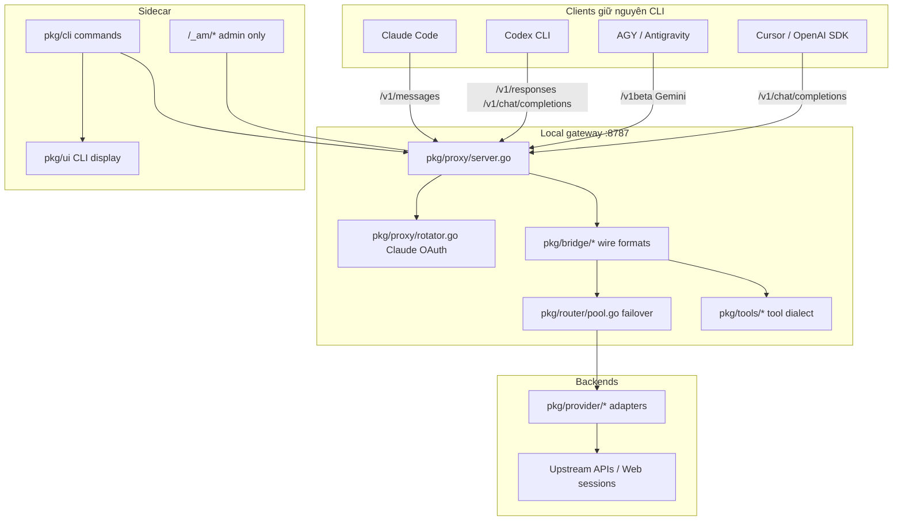

# Bản đồ codebase cho AI — **repo amux** (tool gateway)

> **Scope:** Chỉ dùng khi phát triển hoặc sửa đổi **amux-accounts** (CLI + Universal AI Gateway).  
> **Lưu trữ & Cấu hình:** `~/.amux/` (`identities.json`, `accounts.json`, `config.json`).
> **Mục đích:** Trước khi quét cả repo amux, AI đọc file này (và `docs/ai-locate.yaml`) để biết **đi đâu trước**, **grep gì**, **test nào xác nhận**.  
> Kiến trúc sâu: [`STRUCT.md`](../STRUCT.md).

---

## 1. Quy trình bắt buộc cho agent

```
Mục tiêu người dùng
    → Tra bảng §3 hoặc grep docs/ai-locate.yaml (keywords)
    → Đọc 1–3 file trong read_first (≤400 dòng mỗi file nếu có thể)
    → Grep symbol trong package đó (§4)
    → Chạy test liên quan (§5)
    → Chỉ khi thiếu context mới mở rộng sang package lân cận
```

**Không** bắt đầu bằng `grep` toàn repo trừ khi keyword không có trong bảng §3.

---

## 2. Bản đồ tầng (runtime)



**Luồng dữ liệu canonical:** Mọi bridge chuyển body → `types.ChatRequest` → adapter `SendMessageStream` → `types.StreamChunk` → bridge trả wire client.

---

## 3. Tra cứu theo việc cần làm

| Bạn cần… | Đọc trước | Symbol / grep | Test |
|----------|-----------|---------------|------|
| Sửa hiển thị `amux account list` / `status` / `pool` theo group | `pkg/ui/account_groups.go`, `login.go`, `status.go` | `forEachAccountGroup`, `ResolveAccountGroup` | `pkg/ui/account_groups_test.go` |
| Session A/B/C mỗi tab một account pool | `pool.go` (Send), `guard/affinity.go`, `session_lb.go` | `ExtractSessionKey`, `pickSessionAdapter`, `Pin` | `session_lb_test.go` |
| Thứ tự failover Codex → AGY → web → API | `router/group.go`, `pool.go`, `task_prefer.go` | `GroupPriority`, `GroupOrderForRequest`, `Send` | `group_test.go`, `pool_test.go` |
| Phân loại task / thinking / Pro | `classifier.go`, `task_prefer.go` | `ClassifyTask`, `TaskKind`, `applyTaskClassification` | `classifier_test.go`, `task_prefer_test.go` |
| Claude Code tools (Bash, Read, MCP) | `bridge/claude.go`, `tools/claude.go` | `HandleClaudeMessages` | `claude_test.go`, `dialect_loop_test.go` |
| Codex tools (exec_command, Responses) | `bridge/responses.go`, `openai.go`, `tools/codex.go` | `HandleOpenAIResponses`, `DialectCodex` | `codex_loop_test.go` |
| AGY qua proxy | `bridge/gemini.go`, `cli.go` (`amux hook --agy`) | `GOOGLE_GEMINI_BASE_URL` | `agy_loop_test.go` |
| Web backend + `<tool_call>` | `tools/webloop.go`, `provider/*_web.go` | `MaybeWrapWebStream`, `skipTextOnly` | `webloop_*_test.go` |
| Xoay Claude OAuth 5h/7d | `proxy/rotator.go`, `auth/token.go` | `Rotator`, `ForceSwitch` | `rotator_test.go` |
| Thêm/sửa provider trong pool | `provider/config.go`, `accounts.example.json` | `ProviderConfig`, `BuildAdapters` | `config_test.go` |
| `amux env` / hook / launchctl | `env/env.go`, `hook/hook.go`, `launchctl.go` | `PrintEnvExports`, `SyncLaunchctlEnv` | `env_test.go`, `settings_env_test.go` |
| Guard / quarantine / 429 | `guard/*.go` | `Pace`, `IsQuarantined`, `RecordError` | `guard_test.go` |
| Nén token context (20k budget / 85k runes) | `pkg/ctxshrink/shrink.go`, `bridge/responses.go` | `ShrinkConversation`, `MaxWebRunesLimit` | `pkg/ctxshrink/shrink_test.go` |
| Ma trận tool chéo (Claude ↔ Codex ↔ AGY ↔ Subagent ↔ MCP) | `bridge/cross_tool_matrix_test.go`, `tools/dialect.go` | `TranslateToolCall`, `CanonicalTool` | `cross_tool_matrix_test.go` |
| Dừng gateway (`amux stop`) | `pkg/proxy/client.go`, `pkg/cli/cli.go` | `cmdGatewayStop`, `SaveBindPublic` | `client_test.go`, `cli_test.go` |
| Endpoint `/_am/status` | `proxy/server.go`, `ui/status.go` | `newHandler`, `fetchProxyStatus` | `server_test.go` |
| Integration thật (credentials) | `live/live_test.go` | `//go:build live` | `go test -tags live ./pkg/live` |

Chi tiết machine-readable: [`docs/ai-locate.yaml`](./ai-locate.yaml).

---

## 4. Bề mặt HTTP (gateway)

| Path | Handler chính | Pool / rotator |
|------|----------------|----------------|
| `POST /v1/messages` | `bridge.HandleClaudeMessages` | toolPool + **Rotator** (Claude sub) |
| `POST /v1/chat/completions` | `bridge.HandleChatCompletions` | chatPool |
| `POST /v1/responses` | `bridge.HandleOpenAIResponses` | chatPool (Codex dialect) |
| `POST /v1beta/...` Gemini | `bridge.HandleGemini*` | chatPool |
| `GET /v1/models` | `bridge.HandleModels` | catalog |
| `/_am/status`, `/_am/guard`, `/_am/switch*` | `proxy/server.go` | JSON admin — **không** map slash Claude |

Pin provider: header `X-Provider: <id>` → `router.SendNamed`.

---

## 5. Dữ liệu & ID

| Vị trí | Nội dung |
|--------|----------|
| `~/.amux/accounts.json` | Providers (có thể `AMENC1:` encrypted) — schema `accounts.example.json` |
| `~/.amux/identities.json` | Danh tính phẳng (`IdentityStore`) với trạng thái `Active`, `AutoSwitch`, `Threshold` |
| `~/.amux/profiles/` | Snapshot CLI (`claude`, `codex`, `antigravity`) |
| ID chuẩn | `brand[:method]:NN` — `types.ParseID`, `types.FormatID` |
| Group rotate (logic) | `router/group.go` — `claude_sub`, `codex_sub`, `api_other`, `*_web` |
| UI group API | Tách `API · GEMINI` / `GROQ` từ prefix ID — `ui/apiProviderBrand` |

---

## 6. Package → câu hỏi “có phải vào đây không?”

| Package | Vào khi… |
|---------|----------|
| `pkg/cli` | Lệnh mới, flag, subcommands, help text |
| `pkg/ui` | Terminal output, status dashboard, không đổi routing |
| `pkg/proxy` | Route HTTP, rotator, `/_am`, lifecycle daemon |
| `pkg/bridge` | Đổi format request/response theo client (Claude, Gemini, OpenAI) |
| `pkg/router` | Ai được gọi tiếp theo, cooldown, session, task classifier |
| `pkg/provider` | Gọi upstream cụ thể (API key, web cookie, codex token) |
| `pkg/tools` | Tên/schema tool giữa dialect (Claude, Codex, AGY, Cursor) |
| `pkg/ctxshrink` | Giới hạn token context (20k budget), cắt tỉa tool results, nén body hội thoại |
| `pkg/guard` | Rate limit pacing, affinity, header sanitizer, quarantine |
| `pkg/identity` | Quản lý danh tính phẳng, keychain macOS, migration |
| `pkg/types` | Struct dùng chung — **không** import pkg khác |

---

## 7. Ràng buộc sản phẩm (đừng phá)

1. **Tool chạy trên máy client** (Claude Code / Codex / AGY) — proxy không exec.
2. **`/_am/*` = admin amux** — JSON admin endpoints.
3. **Có native tool API** → bỏ qua web/Codex text-only trong pool (`skipTextOnly`).
4. **Claude IDE + pool** → không dùng `claude_sub` làm proxy backend (`IsClaudeSubscriptionGroup`).
5. **Chỉ dùng Web accounts** cho proxy routing khi có yêu cầu không dùng Subscription account.
6. **`GOOGLE_API_KEY=am-proxy`** không export global trong `amux env` (tránh xung đột gcloud/Maps).

---

## 8. Test nhanh theo vùng

```bash
go test ./pkg/router/ ./pkg/ui/ ./pkg/bridge/ ./pkg/provider/ ./pkg/guard/ -count=1
go test ./... -count=1
```

