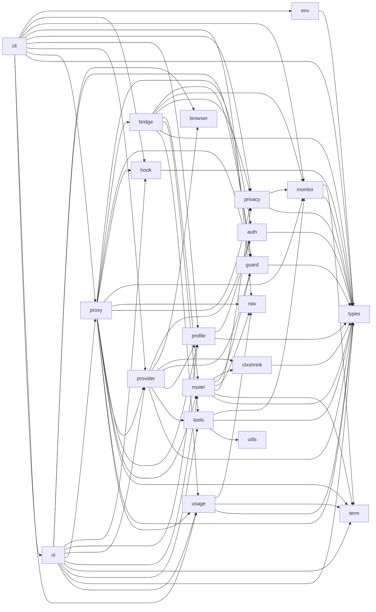

# GRAPH — amux

> Neural map · 22 modules · 101 files · 1223 funcs · 0 LLM tokens  
> docs/GRAPH.md (portable · root=.)  
> AI: đọc **mesh + hubs + 1 subnet** — cấm dump toàn bộ. Chi tiết 1 func: `am map get`.

## Mesh (module → module)

### Sơ đồ nơ-ron (Mermaid — xem trên GitHub / IDE)



### Interactive

```bash
am map viz              # mở GRAPH.html (kéo node, click module → subnet)
am map viz --module nav
# hoặc proxy: http://127.0.0.1:8787/_am/map/viz?root=.
```

### Adjacency (text)

```
auth → types
bridge → guard monitor privacy router tools types usage
cli → env hook monitor nav privacy profile provider proxy types ui usage
ctxshrink → types
env → types
guard → types
hook → types
monitor → term types
privacy → monitor types
profile → auth types
provider → auth browser ctxshrink guard profile tools types
proxy → auth bridge guard hook monitor nav privacy profile provider router term types usage
router → ctxshrink guard nav privacy term types
tools → monitor types utils
ui → browser guard hook profile provider proxy router term tools types usage
usage → nav term types
```

## Neurons (hubs)

| module | files | funcs | hubs |
|--------|------:|------:|------|
| `auth` | 3 | 16 | KCAccount, KCGet, KCSet, RefreshClaudeToken, RefreshLiveClaudeToken, RefreshedCredsJSON |
| `bridge` | 6 | 62 | EstimateBytesTokens, EstimateInputTokens, EstimateStringTokens, HandleClaudeCountTokens, HandleClaudeMessages, ToChatRequest |
| `browser` | 3 | 32 | CaptureCookieViaBrowser, CaptureWebAuthViaBrowser, RefreshWebAuthFromProfile, BrowserInfo, CapturedWebAuth, ChatGPTSession |
| `cli` | 3 | 54 | Run, accountRef, accountToggleHint, applyAccountEnabled, bytesTrim, cmdAdd |
| `ctxshrink` | 1 | 9 | CompactMessages, CompactTranscript, CompactTranscriptWithTail, EstimateMessagesTokens, EstimateTokens, FitMessagesToTokenBudget |
| `env` | 1 | 5 | EnvPath, LoadEnvVars, PrintEnvExports, SaveEnvVars, ShellQuote |
| `guard` | 6 | 54 | Unpin, ActivePinsCount, ExtractSessionKey, GetPinned, NewSessionAffinity, Pin |
| `hook` | 5 | 66 | AutoUpdateConfigFile, IsAutoUpdateEnabled, LaunchAgentPath, SetupAutoUpdate, AddHook, ClaudeAvailable |
| `live` | 0 | 0 |  |
| `monitor` | 3 | 35 | GetLogStats, GetRequestMetrics, ResetRequestMetrics, ResetStats, SetDiagnosticAllBodies, SetLogAllBodies |
| `nav` | 9 | 112 | GitRoot, LearnFuncs, Resolve, WorkspaceDir, ApplyAnnotations, GenerateMap |
| `privacy` | 1 | 20 | RedactString, Kinds, LogHits, MergeResults, RedactBytes, RedactChatRequest |
| `profile` | 2 | 62 | ActivePath, ApplyEntry, AutoBackup, BundlePath, CmdSave, CmdUse |
| `provider` | 16 | 212 | AGYAuthAvailable, AGYCredentialsPath, Group, Priority, SendMessageStream, SupportsTools |
| `proxy` | 11 | 125 | ComposeListenAddr, DialAddr, IsPublicListen, ListenAddr, ListenAddrPath, LoadListenAddr |
| `router` | 6 | 68 | GroupIndex, DetermineAdapterGroup, GroupDisplayName, GroupPriorityForIDE, IDEFromClientDialect, NativeGroups |
| `term` | 2 | 67 | CyanErr, DimErr, GreenErr, Log, LogAuth, LogDegraded |
| `tools` | 7 | 74 | ParseClaudeTools, FromClaudeToolUseBlocks, MarshalClaudeMessagesRequest, ToClaudeToolUseBlocks, ToClaudeTools, ClaudeTool |
| `types` | 6 | 35 | AccountBrandID, AccountBrandIDWithDomain, AccountNamedID, AccountNamedIDWithDomain, EmailDomainPart, EmailLocalPart |
| `ui` | 5 | 83 | CmdDoctorProviders, CmdAPI, CmdAccounts, CmdAccountsCmd, CmdAccountsFilter, CmdLogin |
| `usage` | 4 | 30 | ProjectForRemoteAddr, AppendUsageEntry, ProjectLabel, UsageLogPath, WrapUsageCapture, ChannelLabel |
| `utils` | 1 | 2 | NormalizeJSONSchema, normalizeSchemaNode |


## Subnets

Không nhúng hết vào đây (tiết kiệm token). Lấy 1 subnet:

```bash
am map graph <module>     # ví dụ: am map graph nav
am map graph --list
```
